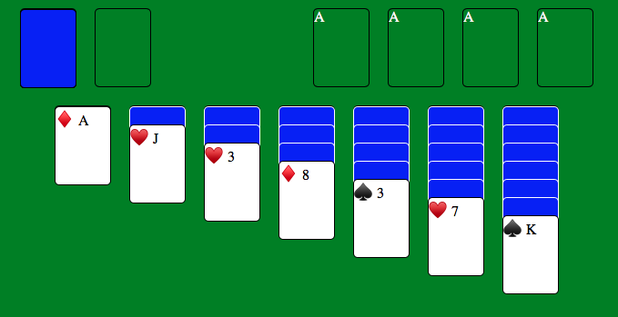

<h1 align="center">
    
</h1>

<h4 align="center"> 
	Paciência.JS
</h4>

  

  
 
  

  
   

 

## 💻 Sobre o projeto

Este jogo foi desenvolvido para exemplificar o uso de conceitos de estruturas de dados como pilhas, filas e listas duplamente encadeadas. Além disso, o jogo conta com drag and drop do HTML5 e algoritmo de embaralhamento.

As regras do jogo são as seguintes:

<h3><u>Objetivo</u></h3>
<ul>
    <li>Mover todas as cartas para as Fundações.</li>
</ul>

<h3><u>Detalhes</u></h3>
<h3>Fundações</h3>
<ul>
    <li>Em ordem crescente e com o mesmo naipe;</li>
    <li>A carta do topo pode ser movimentada.</li>
</ul>

<h3>Pilhas</h3>
<ul>
    <li>Devem ser organizada em ordem decrescente e com cores alternadas;</li>
    <li>As cartas do topo podem ser movimentadas;</li>
    <li>Pilhas completas e incompletas podem ser movimentadas;
Espaços vazios podem ser ocupados pelo Rei ou por pilhas que contenham o Rei.</li>
</ul>

<h3>Estoque</h3>
<ul>
    <li>Clique no estoque para virar, dependendo do jogo, uma ou três cartas;</li>
    <li>Quando esvaziar, clique novamente para que as cartas do descarte voltem para o estoque.</li>
</ul>

<h3>Descarte</h3>
<ul>
    <li>Apenas a carta do topo pode ser movimentada.</li>
</ul>

 

 

## 🛠 Tecnologias

As seguintes ferramentas foram usadas na construção do projeto:

- HTML5
- CSS
- JavaScript

 

 

## 🚀 Como executar o projeto

Basta fazer o download do projeto e executar o arquivo index.js no seu navegador ou [clicar aqui](https://andrefmsouza.github.io/paciencia-js/) para jogar online.

 

 

## 😯 Como contribuir para o projeto

1. Faça um **fork** do projeto.
2. Crie uma nova branch com as suas alterações: `git checkout -b my-feature`
3. Salve as alterações e crie uma mensagem de commit contando o que você fez: `git commit -m "feature: My new feature"`
4. Envie as suas alterações: `git push origin my-feature`
> Caso tenha alguma dúvida confira este [guia de como contribuir no GitHub](https://github.com/firstcontributions/first-contributions)

 

 

## 📝 Licença

Este projeto esta sobe a licença MIT.

Feito com ❤️ por André Souza 👋🏽 [Entre em contato!](https://www.linkedin.com/in/andrefmsouza/)

[license]: https://opensource.org/licenses/MIT
